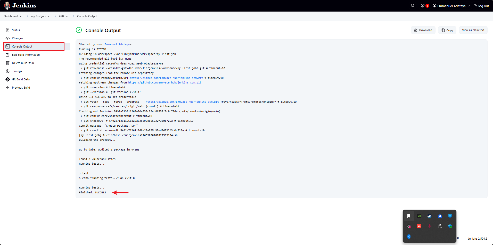

# Automating-Deployment-of-an-E-commerce-website

 As a DevOps Engineer, I am tasked with designing and implementing a CI/CD pipeline using Jenkins to automate the deployment of a web application for a technology consulting firm. The primary goals are to achieve continuous integration, continuous deployment, scalability, and reliability.

 # STEP 1: JENKINS SERVER SET UP

 * Install jenkins on the dedicated server:
 
 
 using the folllowing set of commands to install jenkins on the server
 update package repositories and install JDK
Using the command 
    
    sudo apt update 
    sudo apt install default-jdk-headless

* using the command below to install the jenkins

    wget -q -O - https://pkg.jenkins.io/debian-stable/jenkins.io.key | sudo apt-key add -
    sudo sh -c 'echo deb https://pkg.jenkins.io/debian-stable binary/ > \
    /etc/apt/sources.list.d/jenkins.list'
    sudo apt update
    sudo apt-get install jenkins

   

* check if jenkins was installed and is up and running
 
    sudo systemctl status jenkins

* create an EC2 instance(jenkins) on AWS and set the inbound rule to 8080

* input the jenkins instance ip address on the web browser and set up a jenkins account

note check the lib to locate your Admin Passowrd using the code below:
      
      sudo cat /var/lib/jenkins/secrets/initialAdminPassword

 afterwhich install pluging

Step 6 : Log in to jenkins

# STEP 2: SOURCE CODE MANAGEMENT REPOSITORY INTEGRATION

* Connect jenkins with the source code management (GitHub)

     i. from the jenkins dashboard menu click on new item

      ii. create a Github repository "jenkins-scm" with a README.md file
   
       
      iii. connect jenkins to jenkins-scm repository by pasting the repository url "https://github.com/Emmyace-hub/jenkins-scm.git" in the area below using the 'main' branch

       
       and add my jenkins username and password to the credentials

       
 * configure webhooks for automatic triggering of jenkins builds      
 configure the build trigger on jenkins in order to be able to run a new build anytime a change is made on the github repository
        
        i. click on configure and edit the configuration
  

        ii. under 'trigger'select "Github hook trigger for GITScm polling"
      

        iii. create a githubwebhook using the jenkins ip address'https://975b-86-131-115-109.ngrok-free.app' and port '8080'        

       
       iv. commit a message "2nd update" on my github repository README file a new build was launched automaitically by webhook and clicking on console of the new build #7 to see exactly where changes were made to verify

       

# STEP 3: JENKINS FREESTYLE JOB FOR BUILDING AND RUNNING TEST
  
  * Add Build Steps
      
      i. Scroll to **"Build"** section and Click **"Add build step"** and select **"Execute shell"**

    
      ii. Enter build and test command into the exceute shell box and save:

         #!/bin/bash
         echo "Building the project..."
         # Add your build commands here, e.g.:
         npm install

         echo "Running tests..."
         # Add your test commands here, e.g.:
         npm test
        

       
iii. create a package.json file on github repository contain the script below

           {
           "scripts": {
           "test": "echo \"Running tests...\" && exit 0"
             }
            }

iv. click on build now and check the console output to see if the job was built successfully

# STEP 4: DEVELOP A JENKINS PIPELINE FOR WEB APPLICATION
 
 *  **Create a New Pipeline Job**
   i. From the Jenkins dashboard, click **"New Item"**.
   ii. Enter a name  `webapp-pipeline`, select **"Pipeline"**, and click **OK**.
   

   **Configure Pipeline Script**
   - In the job configuration, scroll to the **Pipeline** section.
   - Select **"Pipeline script"** and enter the script below into the pipeline:
     
         pipeline {
            agent any
         stages {
            stage('Checkout') {
              steps {
                // Clone your repository
                git branch: 'main', url: 'https://github.com/Emmyace-hub/jenkins-scm.git'
             }
          }
            stage('Install Dependencies') {
              steps {
                sh 'npm install'
              }
          }
            stage('Run Tests') {
               steps {
                sh 'npm test'
              }
          }
           stage('Build') {
             steps {
                // Add your build commands here
                sh 'echo "Building the application..."'
              }
          }
          stage('Deploy') {
            steps {
                // Add your deployment commands here
                sh 'echo "Deploying the application..."'
               }
             }
         }
          post {
           success {
            echo 'Pipeline completed successfully!'
         }
           failure {
            echo 'Pipeline failed.'
           }
          }
         }

verify the pipeline ran successfully by clicking on Build now and checking the console output

# STEP 5: DOCKER IMAGE CREATION AND RESISSTRY PUSH

i. **Add Dockerfile to Your Repository**

ii.update the pipeline script to include the docker credentials
 

    pipeline {
    agent any

    environment {
        DOCKERHUB_CREDENTIALS = credentials('dockerhub-creds') // Jenkins Credentials ID
        DOCKER_IMAGE = 'emmyace7/webapp'
    }

    stages {
        stage('Checkout') {
            steps {
                git branch: 'main', url: 'https://github.com/Emmyace-hub/jenkins-scm.git'
            }
        }

        stage('Install Dependencies') {
            steps {
                sh 'npm install'
            }
        }

        stage('Run Tests') {
            steps {
                sh 'npm test'
            }
        }

        stage('Build') {
            steps {
                sh 'echo "Building the application..."'
            }
        }

        stage('Docker Build & Push') {
            steps {
                script {
                    sh "docker build -t $DOCKER_IMAGE:${BUILD_NUMBER} ."
                    sh 'echo "$DOCKERHUB_CREDENTIALS_PSW" | docker login -u "$DOCKERHUB_CREDENTIALS_USR" --password-stdin'
                    sh "docker push $DOCKER_IMAGE:${BUILD_NUMBER}"
                }
            }
        }
    }

    post {
        success {
            echo 'pipeline completed successfully!'
        }
        failure {
            echo 'pipeline failed.'
        }
    }
}

iii. **Configure Jenkins Credentials**
   - In Jenkins, go to **Manage Jenkins > Credentials**.
   - Add your Docker Hub username and password as a "Username with password" credential.
   - Use the ID `dockerhub-credentials` in your pipeline script.

iii. **Verify Docker Installation**
   - Make sure Docker is installed and the Jenkins user has permission to run Docker commands on your Jenkins server.
   
   docker --version
   sudo usermod -aG docker jenkins
   sudo systemctl restart docker
   sudo systemctl restart jenkins

iv. **Run the Pipeline**
   - Click **Build Now** in Jenkins.
   - Check the console output to verify the Docker image is built and pushed to Docker Hub.

